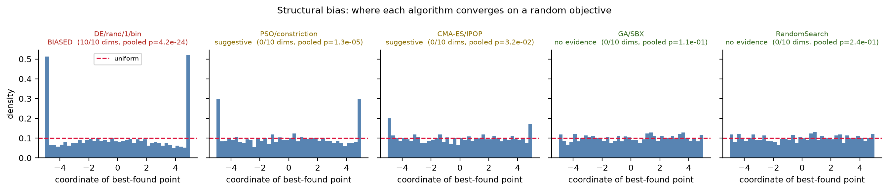
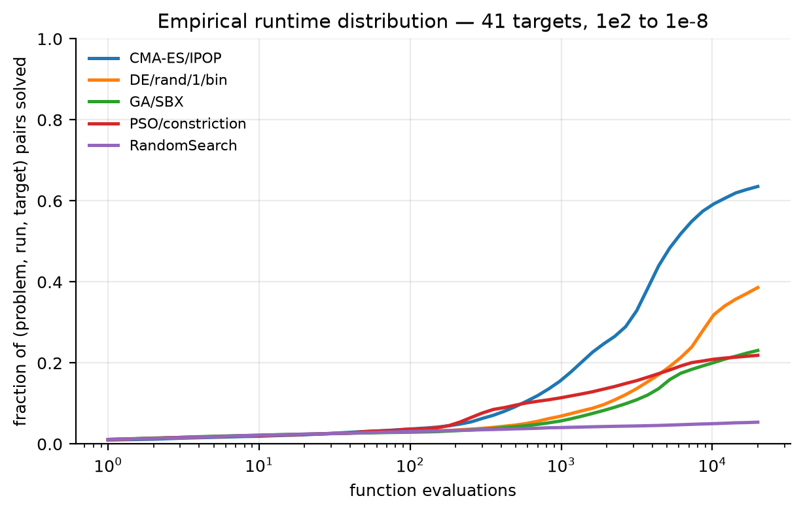

# mhbench

**A reproducible benchmarking and reproduction suite for continuous metaheuristics.**

Five optimizers on 24 BBOB functions at a CEC-protocol budget, compared with Friedman ranks,
Holm-corrected pairwise Wilcoxon tests and Cliff's δ effect sizes — together with a **structural-bias
experiment showing that part of what these benchmarks measure is not search quality.**

This is not a framework. It is an experiment, and the finding is the product.

[](.github/workflows/ci.yml)
[](pyproject.toml)
[](LICENSE)

---

## Findings

**1. DE/rand/1/bin is structurally biased toward the domain boundary.**

Optimising an objective drawn independently of `x` — a landscape that carries *zero* information —
DE/rand/1/bin does not finish in uniformly distributed positions. It concentrates on the bounds, in
**all 10 of 10 dimensions** after Holm correction (pooled KS *D* = 0.117, *p* = 4.2 × 10⁻²⁴). Its
final points sit **15% farther** from the domain centre than uniform sampling would place them.

Since the landscape is pure noise, no part of that structure can be attributed to the problem. It is
a property of the algorithm — specifically, of the algorithm *together with its bound-handling rule*.

**2. The effect is graded, and the control behaves correctly.**

<!-- BIAS:START -->

*Generated by `make exp02` from 200 independent runs per algorithm on a random objective — do not edit by hand.*

| Algorithm | Verdict | Dims biased (Holm) | Pooled KS *p* | Distance to centre vs. uniform |
|---|---|---|---|---|
| `DE/rand/1/bin` | **biased** | **10 / 10** | 4.2 × 10⁻²⁴ | 1.152× (outward) |
| `PSO/constriction` | suggestive | 0 / 10 | 1.3 × 10⁻⁵ | 1.062× (outward) |
| `CMA-ES/IPOP` | suggestive | 0 / 10 | 3.2 × 10⁻² | 1.030× (outward) |
| `GA/SBX` | no evidence | 0 / 10 | 1.1 × 10⁻¹ | 1.009× (outward) |
| `RandomSearch` | no evidence | 0 / 10 | 2.4 × 10⁻¹ | 1.018× (outward) |

<!-- BIAS:END -->

`RandomSearch` is the control: it samples uniformly by construction, so a bias test that flagged it
would be broken. It is not flagged. The detector is separately validated against synthetic
ground truth in `tests/test_bias.py` — silent on uniform samples, firing on both boundary-biased and
centre-biased ones, and naming the direction correctly.



**3. The ranking reverses with budget — a single end-of-run number hides it.**



At a budget of ~600 evaluations, `PSO/constriction` solves **1.88×** as many (problem, run, target)
pairs as `DE/rand/1/bin`. DE overtakes it at **~5,200 evaluations**, and by 20,000 it solves
**1.76×** as many as PSO — a complete reversal inside one experiment.

Both algorithms appear in the rank table below as a single number each — DE at 2.52, PSO at 2.90.
Which number you get depends entirely on where the budget was cut, and the table cannot tell you
that.

The statistics make the same point from the other direction: **the DE–PSO difference is not
significant** (Holm-corrected pairwise Wilcoxon, *p* = 0.54), despite the rank gap. Reading the rank
column alone would invite a conclusion the data does not support, in a comparison whose true answer
is *"it depends on the budget, and at this one they are indistinguishable."*

This is the concrete case for reporting an empirical runtime distribution rather than a performance
scalar: the crossover is the result, and it is invisible in the aggregate.

**4. Why this matters for every benchmark table, including the one below.**

Benchmark suites overwhelmingly place optima at or near the centre of the search domain. An
algorithm with a centre-directed bias scores well on them for a reason unrelated to search quality —
and a performance table cannot distinguish the artifact from genuine competence, because both
produce the same numbers.

The bias measured here is *outward*, which is the opposite orientation and therefore a handicap on
centre-optimum suites rather than an advantage. That does not make it harmless: it means a
non-trivial share of DE's measured performance on such suites reflects where its repair rule pushes
points, not how well it searches.

**The practical consequence: a bound-handling rule is part of the algorithm.** Clipping is applied
identically to every optimizer here and is declared in `docs/METHODOLOGY.md`. A published comparison
that leaves it unstated is comparing something the reader cannot reconstruct.

Note also that `CMA-ES/IPOP` registers as *suggestive* here where the same code without restarts
registered as *no evidence*. Restarts re-initialise from fresh points and change where the algorithm
finishes. That is a second instance of the same lesson: **a termination-and-restart policy is part of
the algorithm too**, and the bias measured is always of the algorithm plus its configuration, never
of a Platonic method.

<!-- RESULTS:START -->

*Generated by `make report` from `experiments/exp01_bbob_d10/results/runs.csv` — do not edit by hand.*

**BBOB d=10, five algorithms** · 24 problems · 5 algorithms · 30 runs · 20,000 FEs · 3,600 total runs

Friedman χ² = 57.8, p = 8.61e-12 (significant at α=0.05)

| Algorithm                                        |   Avg. Friedman rank |
|:-------------------------------------------------|---------------------:|
| CMA-ES/IPOP sigma0=0.3*span ipop=x2              |                 1.58 |
| DE/rand/1/bin F=0.5 CR=0.9 NP=50                 |                 2.52 |
| PSO/constriction N=40 c1=2.05 c2=2.05 chi=0.7298 |                 2.90 |
| GA/SBX NP=50 pc=0.9 eta_c=20.0 eta_m=20.0        |                 3.08 |
| RandomSearch                                     |                 4.92 |

**Post-hoc pairwise Wilcoxon signed-rank, Holm-corrected** (p-values)

|                  | CMA-ES/IPOP   | DE/rand/1/bin   | GA/SBX   | PSO/constriction   | RandomSearch   |
|:-----------------|:--------------|:----------------|:---------|:-------------------|:---------------|
| CMA-ES/IPOP      | —             | 0.0017          | 0.0101   | <0.0001            | <0.0001        |
| DE/rand/1/bin    | 0.0017        | —               | 0.0865   | 0.5426             | <0.0001        |
| GA/SBX           | 0.0101        | 0.0865          | —        | 0.9658             | <0.0001        |
| PSO/constriction | <0.0001       | 0.5426          | 0.9658   | —                  | <0.0001        |
| RandomSearch     | <0.0001       | <0.0001         | <0.0001  | <0.0001            | —              |

Diagonal omitted. Note **DE/rand/1/bin vs PSO/constriction is not significant** despite a rank gap — see finding 3.

<!-- RESULTS:END -->

---

## Reproduce

```bash
make setup      # venv and pinned dependencies
make all        # regenerate every table and figure from archived raw results
make verify     # assert the reproducibility invariants against the raw data
```

Re-run the experiments from scratch:

```bash
make experiment
```

**Every number in this README is generated by `make report`, not typed.** The results block above is
rewritten from `runs.csv` on each run, so a stale claim is structurally impossible.

---

## What was measured

| | |
|---|---|
| **Suites** | BBOB (24 functions) via [IOHexperimenter](https://iohprofiler.github.io/); CEC 2017 via [opfunu](https://github.com/thieu1995/opfunu) |
| **Dimension** | 10 |
| **Budget** | **2,000 × D = 20,000 function evaluations**, fixed and identical for every algorithm |
| **Runs** | 30 per (problem, algorithm) on BBOB; 200 per algorithm for the bias study |
| **Seeds** | Spawned from one master seed via `numpy.random.SeedSequence`, **recorded per run** in `runs.csv` |
| **Metric** | Target error `f(x_best) − f(x*)`, with `f(x*)` read from the suite rather than assumed to be 0 |
| **Aggregation** | **Median and IQR.** Never mean ± std — these distributions are bounded and skewed |

### Algorithms

Variants are named precisely. There is no single "PSO" or "DE", and conflating variants is a
recurring defect in published comparisons.

| Algorithm | Provenance |
|---|---|
| `RandomSearch` | Uniform sampling. A control, not a strawman |
| `DE/rand/1/bin` F=0.5 CR=0.9 NP=50 | Storn & Price (1997) |
| `PSO/constriction` N=40 c₁=c₂=2.05 | Clerc & Kennedy (2002). **Deliberately not called "Standard PSO 2011"** — SPSO-2011's rotation-invariant hypersphere update is not implemented here |
| `GA/SBX` NP=50 η=20 | Real-coded: tournament selection, SBX crossover, polynomial mutation, (μ+λ) elitism |
| `CMA-ES/IPOP` σ₀ = 0.3·span, popsize ×2 per restart | [`cma`](https://github.com/CMA-ES/pycma) — **Hansen's reference implementation, deliberately not reimplemented** — with IPOP restarts (Auger & Hansen 2005). See below for why restarts are not optional |

### Declared deviations

- **Bound handling is clipping**, applied identically to all algorithms. Not a neutral default — see
  finding 3. Declared rather than hidden.
- **No parameter tuning.** Published defaults throughout. Tuning one side and not the other is the
  most common way a comparison misleads; tuning neither is the honest option at this scale, and
  tuning both is the better one (see Limitations).
- **CEC 2017 F2 is excluded** where that suite is used. It is widely dropped for numerical
  instability, and the exclusion is a named argument in the config (`exclude: [2]`), not a silent
  omission.
- **CMA-ES is run with IPOP restarts, and this is a methodological choice, not a tweak.** CMA-ES has
  its own termination criteria and is built to stop once converged or stagnated. A budget far larger
  than it needs therefore poses a question the bare algorithm does not answer: what to do with the
  remainder. Driving a single instance past its own stopping criteria is not neutral — it drove the
  step size to overflow and the covariance update to NaN, and an earlier version of this code
  crashed a 40-minute experiment on exactly that. Restarting with a doubled population is the answer
  the algorithm's own literature gives, and it is what BBOB comparisons of CMA-ES actually run.
- **The budget is 2,000 × D rather than the 10,000 × D of the CEC protocol.** Chosen so the full
  design completes reliably on one workstation. The empirical runtime distribution below reports
  performance across 41 target levels as a function of budget, so every claim made here is a
  claim about anytime behaviour within that budget and does not depend on the cutoff.

---

## How it was tested

```
per-run raw results
        ├── aggregate per (algorithm, problem) → median
        ▼
  [1] Friedman test, problems as blocks → average ranks
        │     not significant → STOP. No post-hoc.
        ▼
  [2] pairwise Wilcoxon signed-rank + Holm step-down correction
        ▼
  [3] Cliff's δ — per problem, on RAW RUNS, never on the aggregates
```

Steps 1–2 consume the algorithms × problems matrix of aggregates. **Step 3 does not.** Cliff's δ
measures stochastic dominance between two *samples*; computed over one median per problem it merely
restates the Friedman ranking, while over the raw runs within a problem it answers the question an
effect size exists to answer. `mhbench.stats` gives the two operations different names and different
input types so they cannot be silently interchanged.

Because these are **errors**, a *negative* δ means the first algorithm is better — the opposite of
the usual reading, and an easy place to publish a sign error. `tests/test_stats.py` pins it.

Full rationale, including what the bias experiment *cannot* show: **[`docs/METHODOLOGY.md`](docs/METHODOLOGY.md)**.

---

## Limitations

Stated because they bound what the results above support.

1. **No parameter tuning.** Every algorithm runs published defaults. A tuned comparison could
   reorder the ranking, and the honest claim is about default-parameter behaviour only.
2. **One dimension (D=10) and one instance per BBOB function.** Rankings in this field are known to
   shift with dimension; nothing here speaks to D=30 or D=100.
3. **The bias test detects bias on a flat landscape.** An algorithm unbiased there may still behave
   poorly on structured landscapes, and a biased one is not thereby useless — the bias matters only
   to the extent that benchmark optima sit where it points.
4. **The per-dimension bias test is underpowered at 200 runs.** PSO's pooled test rejects while no
   individual dimension survives Holm correction. That disagreement is why the verdict is reported
   in three tiers rather than as a binary flag, and it is why PSO is called *suggestive* rather than
   biased. More runs would settle it.
5. **Bias is measured for the algorithm *and* its repair rule jointly.** This design cannot separate
   the two. Distinguishing them requires re-running under alternative bound handling (reflection,
   resampling, toroidal wrapping) — the obvious next experiment.
6. **No claim of a general winner.** Results are per suite, per dimension, per problem, with effect
   sizes. No comparison at this scale can support "algorithm X is best".
7. **The budget is 2,000 × D, not the 10,000 × D of the CEC protocol.** Algorithms that trade early
   progress for late refinement are disadvantaged by a shorter budget. The ECDF is reported
   precisely so this is visible rather than hidden in a single end-of-run number.

---

## Layout

```
src/mhbench/
├── problems/     three backends behind one interface; the wrapper owns the budget
├── algorithms/   five optimizers, each naming its published variant
├── stats/        Friedman → Holm-corrected Wilcoxon → Cliff's δ
├── report/       tables, convergence curves, COCO-style ECDF, rank plots
├── bias.py       structural-bias study (execution and analysis separated)
└── runner.py     seeding, budget enforcement, parallelism, manifests
experiments/      one config per experiment; results and manifests alongside
docs/             methodology
scripts/          reproducibility invariant checks
```

## Tests

```bash
make test
```

Covering: Cliff's δ boundary cases and sign convention · Friedman rank recovery · refusal to
post-hoc a non-significant omnibus · Holm correction against hand-computed values · budget
enforcement for every algorithm · exact reproduction from a master seed · seed distinctness ·
best-so-far monotonicity · bias detector validated against synthetic biased *and* unbiased ground
truth · failed runs recorded rather than propagated, and excluded from every aggregation ·
table and figure generation.

Two of these are regression tests for defects found by running the experiments rather than by
reading the code: a diverging optimizer that killed a 40-minute run at the final gather, and
construction errors that escaped the per-run guard. Both now produce a recorded failure and let
the experiment finish.

## Citation

See [`CITATION.cff`](CITATION.cff). Raw results are archived with a DOI on release; derived tables
and figures are committed so every claim here is checkable without re-running anything.

References are listed in [`docs/METHODOLOGY.md`](docs/METHODOLOGY.md).
